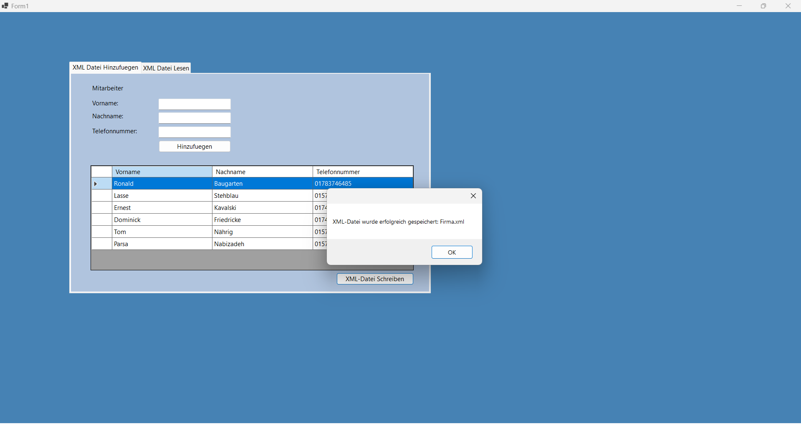
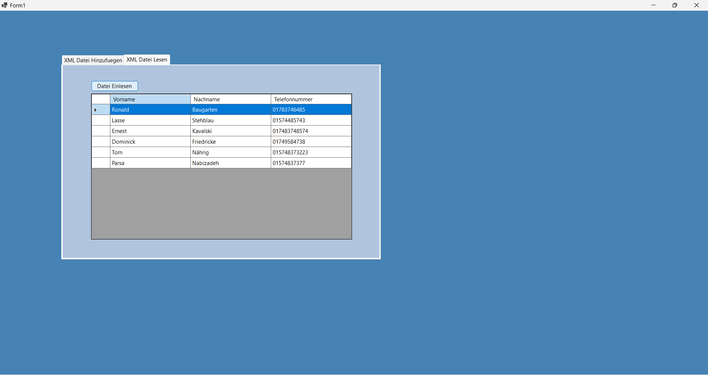
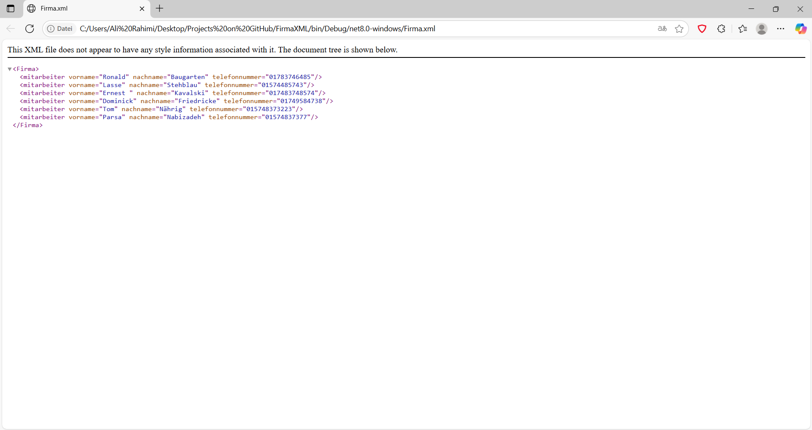

# FirmaXML

FirmaXML ist eine Windows Forms Anwendung in C#, die es ermöglicht, Mitarbeiterdaten im XML-Format zu verwalten, anzuzeigen und lokal zu speichern.

## Funktionen
- **XML einlesen:** Die Anwendung lädt Mitarbeiterdaten aus einer XML-Datei und zeigt sie in einer DataGridView an.
- **XML speichern:** Die angezeigten Mitarbeiterdaten können als eigene XML-Datei (`Firma.xml`) im Ausgabeverzeichnis gespeichert werden.

## Aufbau
- `Form1.cs`: Hauptfenster mit Logik zum Einlesen, Bearbeiten und Speichern der Mitarbeiterdaten.
- `mitarbeiter.cs`: Datenmodell für einen Mitarbeiter.
- `Form1.Designer.cs`: UI-Layout der Anwendung.
- `Program.cs`: Einstiegspunkt der Anwendung.

## Nutzung
1. **Projekt kompilieren** (z.B. mit Visual Studio).
2. Anwendung starten (`FirmaXML.exe`).
3. Auf "XML Lesen" klicken, um Mitarbeiterdaten zu laden.
4. Mit "XML Schreiben" die Daten als `Firma.xml` speichern.

## Hinweise
- Die Datei `Firma.xml` wird im Build-Output-Ordner (z.B. `bin\Debug\net8.0-windows`) gespeichert.
- Die Anwendung benötigt keine Internetverbindung.

### Vorschau

**Anwendung** (`FirmaXML.exe`):  

**XML-Datei-Lesen** (`Firma.xml`):  

**XML-Datei-Browser** (`Firma.xml`):  

